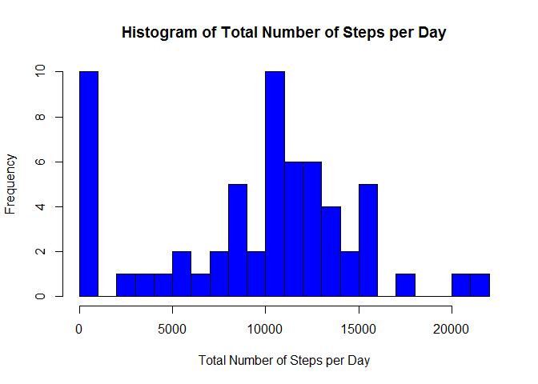
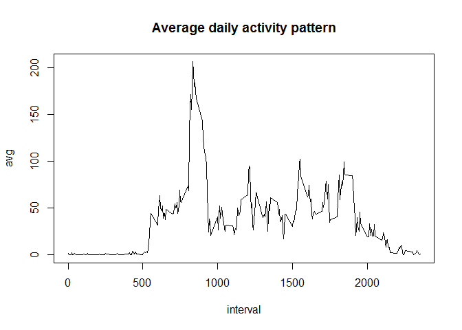
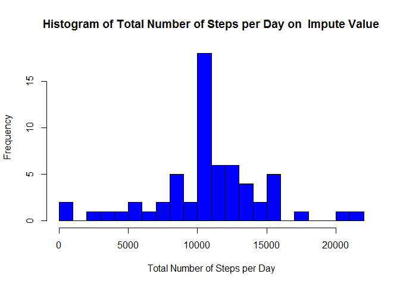
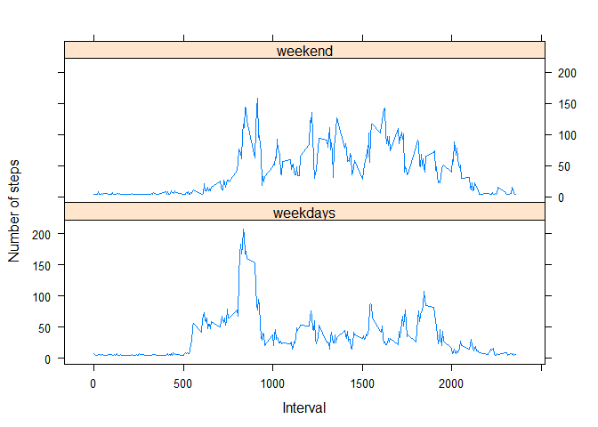

# Reproducible Research: Peer Assessment 1


```r
library(ggplot2)
library(scales)
library(Hmisc)
```

```
## Loading required package: grid
## Loading required package: lattice
## Loading required package: survival
## Loading required package: Formula
## 
## Attaching package: 'Hmisc'
## 
## The following objects are masked from 'package:base':
## 
##     format.pval, round.POSIXt, trunc.POSIXt, units
```

## 1) Loading and preprocessing the data

```r
setwd("D:/r/Reproducible research/Project")
if(!file.exists('activity.csv')){
  unzip('./repdata-data-activity.zip')
}

activityData <- read.csv('activity.csv',header=T,sep=",")

str(activityData)
```

```
## 'data.frame':	17568 obs. of  3 variables:
##  $ steps   : int  NA NA NA NA NA NA NA NA NA NA ...
##  $ date    : Factor w/ 61 levels "2012-10-01","2012-10-02",..: 1 1 1 1 1 1 1 1 1 1 ...
##  $ interval: int  0 5 10 15 20 25 30 35 40 45 ...
```
### Process/transform the date field in Activity monitoring data into a date format suitable for your analysis

```r
activityData$date<-as.Date(activityData$date)
str(activityData)
```

```
## 'data.frame':	17568 obs. of  3 variables:
##  $ steps   : int  NA NA NA NA NA NA NA NA NA NA ...
##  $ date    : Date, format: "2012-10-01" "2012-10-01" ...
##  $ interval: int  0 5 10 15 20 25 30 35 40 45 ...
```

## 2) What is mean total number of steps taken per day?
### i) Make a histogram of the total number of steps taken each day

```r
activityDatasteps<-tapply(activityData$steps,activityData$date,sum,na.rm=TRUE)
```

```r
library(reshape2)
activityDatamelt<-melt(activityDatasteps)
names(activityDatamelt)<-c('Date','SumofSteps')
head(activityDatamelt)
```

```
##         Date SumofSteps
## 1 2012-10-01          0
## 2 2012-10-02        126
## 3 2012-10-03      11352
## 4 2012-10-04      12116
## 5 2012-10-05      13294
## 6 2012-10-06      15420
```

```r
hist(activityDatamelt$SumofSteps,main="Histogram of Total Number of Steps per Day",xlab="Total Number of Steps per Day",ylab="Frequency",col='blue',breaks=30)
```

 
### ii) Calculate and report the mean and median total number of steps taken per day

```r
mean(activityDatamelt$SumofSteps,na.rm=T);median(activityDatamelt$SumofSteps,na.rm=T)
```

```
## [1] 9354.23
```

```
## [1] 10395
```

## 3) What is the average daily activity pattern?

### i) Make a time series plot (i.e. type = "l") of the 5-minute interval (x-axis) and the average number of steps taken, averaged across all days (y-axis)


```r
activityDataavg<-tapply(activityData$steps,activityData$interval,mean,na.rm=T)
activityDatamelt_avg<-melt(activityDataavg)
names(activityDatamelt_avg)<-c("interval","avg")
nrow(activityDatamelt_avg)
```

```
## [1] 288
```

```r
plot(avg~interval,data=activityDatamelt_avg,type="l",main="Average daily activity pattern")
```

 
### ii) which 5-minute interval, on average across all the days in the dataset, contains the maximum number of steps?

```r
activityDatamelt_avg[activityDatamelt_avg$avg==max(activityDatamelt_avg$avg),]
```

```
##     interval      avg
## 104      835 206.1698
```

## 4) Imputing missing values

### i) Calculate and report the total number of missing values in the dataset (i.e. the total number of rows with NAs)

```r
colSums(is.na(activityData))
```

```
##    steps     date interval 
##     2304        0        0
```
### ii) Devise a strategy for filling in all of the missing values in the dataset. The strategy does not need to be sophisticated. For example, you could use the mean/median for that day, or the mean for that 5-minute interval, etc.

```r
mean(activityData$steps,na.rm=T)
```

```
## [1] 37.3826
```

#### iii) Create a new dataset that is equal to the original dataset but with the missing data filled in.


```r
activityDataimpute<-activityData
activityDataimpute$steps[is.na(activityDataimpute$steps)]<-mean(activityDataimpute$steps,na.rm=T)
colSums(is.na(activityDataimpute))
```

```
##    steps     date interval 
##        0        0        0
```

### iv) Make a histogram of the total number of steps taken each day and Calculate and report the mean and median total number of steps taken per day. Do these values differ from the estimates from the first part of the assignment? What is the impact of imputing missing data on the estimates of the total daily number of steps?


```r
activityDataimputesteps<-tapply(activityDataimpute$steps,activityDataimpute$date,sum)
```

```r
library(reshape2)
activityDatameltimpute<-melt(activityDataimputesteps)
names(activityDatameltimpute)<-c('Date','SumofSteps')
head(activityDatameltimpute)
```

```
##         Date SumofSteps
## 1 2012-10-01   10766.19
## 2 2012-10-02     126.00
## 3 2012-10-03   11352.00
## 4 2012-10-04   12116.00
## 5 2012-10-05   13294.00
## 6 2012-10-06   15420.00
```

```r
hist(activityDatameltimpute$SumofSteps,main="Histogram of Total Number of Steps per Day on  Impute Value",xlab="Total Number of Steps per Day",ylab="Frequency",col='blue',breaks=30)
```

 
### ii) Calculate and report the mean and median total number of steps taken per day

```r
mean(activityDatameltimpute$SumofSteps,na.rm=T);median(activityDatameltimpute$SumofSteps,na.rm=T)
```

```
## [1] 10766.19
```

```
## [1] 10766.19
```
#### (Mean = Median) after imputing missing value with mean value of steps. Now it became less skewed. 


## 5) Are there differences in activity patterns between weekdays and weekends?


```r
activityDataimpute$weekdays<-weekdays(activityDataimpute$date)

activityDataimpute$weeks[(activityDataimpute$weekdays=="Saturday" | activityDataimpute$weekdays=="Sunday")]<-"weekend"
activityDataimpute$weeks[!(activityDataimpute$weekdays=="Saturday" | activityDataimpute$weekdays=="Sunday")]<-"weekdays"
```


```r
library(plyr)
```

```
## 
## Attaching package: 'plyr'
## 
## The following objects are masked from 'package:Hmisc':
## 
##     is.discrete, summarize
```

```r
week_comp<- ddply(activityDataimpute, c("interval","weeks"), function (x) apply(x[1], 2, mean))
head(week_comp)
```

```
##   interval    weeks    steps
## 1        0 weekdays 7.006569
## 2        0  weekend 4.672825
## 3        5 weekdays 5.384347
## 4        5  weekend 4.672825
## 5       10 weekdays 5.139902
## 6       10  weekend 4.672825
```


```r
library(lattice)
xyplot(steps~interval | weeks,data=week_comp,type="l",xlab="Interval", ylab="Number of steps",layout=c(1,2))
```

 
